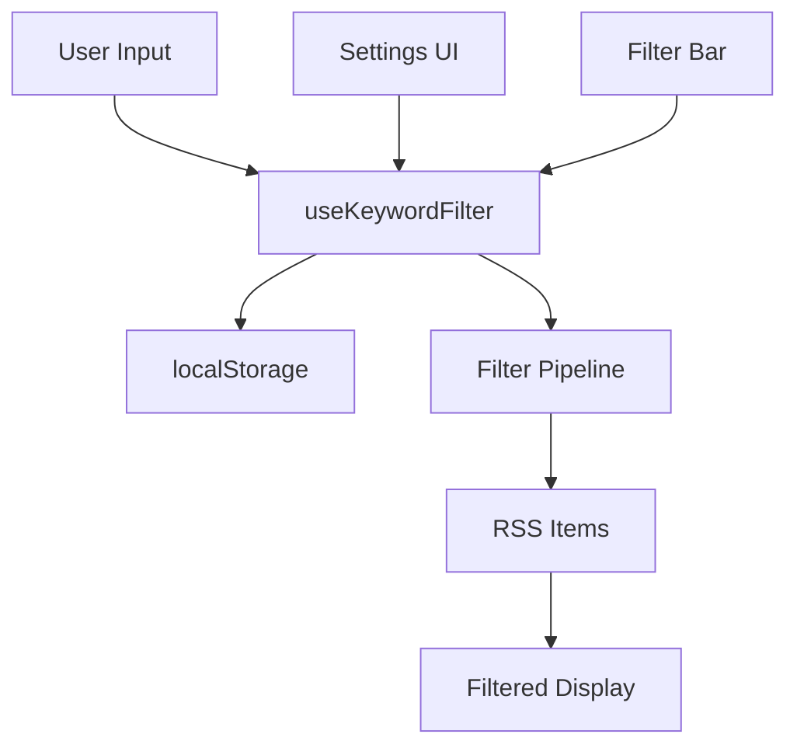

# Keyword Filtering System Documentation

## Overview

The KNUE Board Hub implements a comprehensive keyword filtering system that allows users to automatically hide RSS feed items containing specific keywords. This feature enhances user experience by filtering out unwanted content based on customizable keyword lists.

## Architecture

### Core Components

1. **`useKeywordFilter.js`** - Vue 3 composable managing filtering logic
2. **DepartmentsView.vue** - Settings interface for keyword management  
3. **RssFeedList.vue** - Main feed with integrated filtering
4. **localStorage** - Persistent keyword storage

### Data Flow



## API Reference

### useKeywordFilter Composable

#### State Properties

```javascript
const {
  blockedKeywords,      // Array<string> - List of blocked keywords
  hasBlockedKeywords,   // boolean - Whether any keywords are blocked
} = useKeywordFilter()
```

#### Core Methods

```javascript
// Keyword Management
addBlockedKeyword(keyword: string): boolean
removeBlockedKeyword(keyword: string): boolean
clearBlockedKeywords(): boolean

// Filtering Operations
filterItems(items: RSS[]): RSS[]
containsBlockedKeyword(text: string): boolean
getMatchingKeywords(text: string): string[]

// Statistics
getFilterStats(original: RSS[], filtered: RSS[]): FilterStats

// Import/Export
importKeywords(text: string): number
exportKeywords(): string
```

#### Method Details

##### `addBlockedKeyword(keyword)`
- **Purpose**: Adds a keyword to the blocked list
- **Parameters**: `keyword` (string) - Case-insensitive keyword to block
- **Returns**: `boolean` - `true` if added, `false` if already exists
- **Side Effects**: Saves to localStorage, triggers reactivity

##### `filterItems(items)`
- **Purpose**: Filters RSS items based on blocked keywords
- **Parameters**: `items` (Array) - RSS items to filter
- **Returns**: Array - Items without blocked keywords
- **Logic**: Checks title, description, and content fields

##### `getFilterStats(original, filtered)`
- **Purpose**: Calculates filtering statistics
- **Returns**: Object with `originalCount`, `filteredCount`, `blockedCount`, `blockPercentage`

## User Interface

### Settings Page (/departments)

#### Keyword Input Section
- Text input with Enter key support
- Real-time validation and feedback
- Duplicate prevention

#### Keyword Management
- Visual keyword tags with remove buttons
- Bulk operations (clear all)
- Keyword count display

#### Import/Export Modal
- Batch keyword import from text
- Support for comma and newline separators
- Export to clipboard or file download

#### Statistics Display
- Real-time filtering impact metrics
- Blocked post count and percentage

### Main Feed Page

#### Filter Bar Integration
- Active keyword indicators (max 3 displayed)
- One-click keyword removal
- "More keywords" link for overflow

#### Feed Statistics
- Blocked keyword count in summary
- Visual distinction with red color scheme

## Implementation Guide

### Basic Setup

```javascript
// In your Vue component
import { useKeywordFilter } from '@/composables/useKeywordFilter.js'

export default {
  setup() {
    const {
      blockedKeywords,
      addBlockedKeyword,
      filterItems
    } = useKeywordFilter()
    
    return {
      blockedKeywords,
      addBlockedKeyword,
      filterItems
    }
  }
}
```

### Filtering RSS Items

```javascript
// Apply keyword filtering to RSS items
const filteredItems = computed(() => {
  let items = [...allItems.value]
  
  // Apply keyword filter first for performance
  if (hasBlockedKeywords.value) {
    items = filterItems(items)
  }
  
  // Apply other filters...
  return items
})
```

### Adding Keywords Programmatically

```javascript
// Add single keyword
const wasAdded = addBlockedKeyword('spam')
if (wasAdded) {
  showSuccess('Keyword added successfully')
}

// Import multiple keywords
const addedCount = importKeywords('spam,promotion,advertisement')
showSuccess(`${addedCount} keywords imported`)
```

## Performance Considerations

### Optimization Strategies

1. **Early Filtering**: Keywords applied before other filters
2. **Set-Based Storage**: O(1) lookup performance for keyword checks
3. **Case Preprocessing**: Lowercase conversion done once during storage
4. **Reactive Caching**: Vue reactivity system prevents unnecessary recalculations

### Memory Usage

- Keywords stored as Set in memory for fast access
- localStorage used for persistence (typical limit: 5-10MB)
- Automatic cleanup prevents memory leaks

### Scalability Limits

- **Recommended**: <100 keywords for optimal performance
- **Maximum**: Limited by localStorage capacity (~2MB for keywords)
- **Performance**: Linear degradation with keyword count

## Error Handling

### localStorage Failures
```javascript
// Graceful degradation when localStorage unavailable
try {
  localStorage.setItem(STORAGE_KEY, data)
} catch (error) {
  console.warn('Failed to save keywords:', error)
  // Continue with in-memory operation
}
```

### Invalid Input Handling
- Empty strings filtered out
- Non-string inputs rejected
- Duplicate keywords prevented
- Whitespace trimmed automatically

## Testing Strategy

### Unit Tests
```javascript
describe('useKeywordFilter', () => {
  test('adds keyword successfully', () => {
    const { addBlockedKeyword } = useKeywordFilter()
    expect(addBlockedKeyword('test')).toBe(true)
    expect(addBlockedKeyword('test')).toBe(false) // duplicate
  })
  
  test('filters items correctly', () => {
    const { addBlockedKeyword, filterItems } = useKeywordFilter()
    addBlockedKeyword('spam')
    
    const items = [
      { title: 'Normal post', description: 'Content' },
      { title: 'Spam post', description: 'Content' }
    ]
    
    const filtered = filterItems(items)
    expect(filtered).toHaveLength(1)
  })
})
```

### Integration Tests
- Settings page keyword management
- Feed filtering behavior
- Import/export functionality
- localStorage persistence

## Accessibility Features

### Keyboard Navigation
- Enter key support for keyword input
- Tab navigation through keyword tags
- Screen reader compatible labels

### Visual Indicators
- High contrast red color for blocked keywords
- Clear visual hierarchy in settings
- Consistent iconography (filter, ban, remove)

### Mobile Optimization
- Touch-friendly button sizes (minimum 44px)
- Responsive layout adaptation
- Gesture-friendly interactions

## Security Considerations

### Data Sanitization
- XSS prevention through text-only storage
- No HTML interpretation in keywords
- Input validation and trimming

### Privacy
- All data stored locally in user's browser
- No server-side keyword tracking
- User has full control over data deletion

## Migration and Versioning

### Future Enhancements
- Regular expression support
- Category-based keyword grouping
- Temporary keyword blocking
- Keyword suggestion system

### Backward Compatibility
- Storage format versioning planned
- Graceful migration for schema changes
- Fallback to default behavior on corruption

## Troubleshooting

### Common Issues

**Keywords not persisting**
- Check localStorage availability and quota
- Verify browser privacy settings
- Clear browser data and reinitialize

**Filtering not working**
- Confirm case-insensitive matching
- Check for special characters in keywords
- Verify RSS item field structure

**Performance issues**
- Reduce keyword count (<50 recommended)
- Use more specific keywords
- Clear browser cache and restart

**Import/export failures**
- Check text encoding (UTF-8 expected)
- Verify separator format (comma or newline)
- Ensure no special characters in export

### Debug Tools

```javascript
// Enable debug logging
localStorage.setItem('debug-keyword-filter', 'true')

// View current keywords
console.log('Blocked keywords:', JSON.parse(localStorage.getItem('knue-board-hub:blocked-keywords')))

// Test filtering manually
const { filterItems, addBlockedKeyword } = useKeywordFilter()
addBlockedKeyword('test')
console.log('Filtered:', filterItems([{ title: 'test post' }]))
```

## Contributing

### Code Style
- Follow Vue 3 Composition API patterns
- Use TypeScript types for better IDE support
- Maintain consistent error handling
- Include comprehensive JSDoc comments

### Testing Requirements
- Unit tests for all public methods
- Integration tests for UI components
- Performance benchmarks for large datasets
- Accessibility compliance verification

---

**Last Updated**: December 2024
**Version**: 1.0.0
**Authors**: KNUE Board Hub Development Team